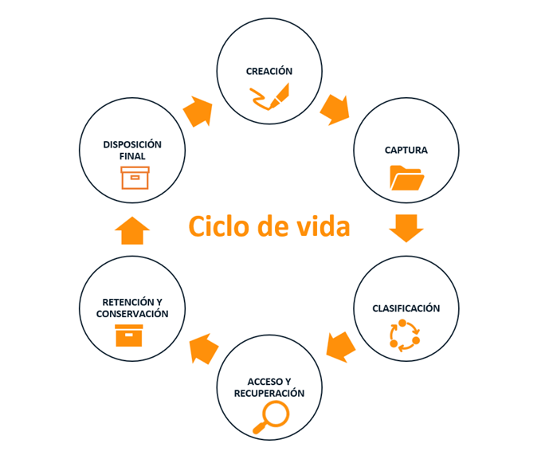

# Ciclo de vida de los sistemas de control de documentos.

<figure><figcaption>
Ciclo de vida de los documentos, obtenido de: <a href="https://www.brait.cc/blog/gestionar-ciclo-vida-documentos-opentext-extended-ecm">https://www.brait.cc/blog/gestionar-ciclo-vida-documentos-opentext-extended-ecm</a>
</figcaption></figure>

1. **Creación:** Es la etapa en la que se genera un documento por primera vez. Esto puede incluir la redacción de un informe, la creación de un contrato, la elaboración de una hoja de cálculo, etc.
2. **Captura:** Consiste en la recolección y almacenamiento inicial del documento dentro del sistema de control de documentos.
3. **Clasificación y/o Procesamiento:** Es la etapa en la que los documentos se organizan y procesan para facilitar su gestión y recuperación futura.
4. **Acceso y Recuperación:** Implica la búsqueda y recuperación de documentos almacenados para su consulta o uso.
5. **Retención y/o Conservación:** Se refiere al almacenamiento seguro y la conservación de los documentos durante el tiempo necesario para cumplir con requisitos legales, regulatorios o de negocios.
6. **Disposición Final:** Es la etapa en la que los documentos se eliminan o destruyen de acuerdo con las políticas de retención y los requisitos legales.
