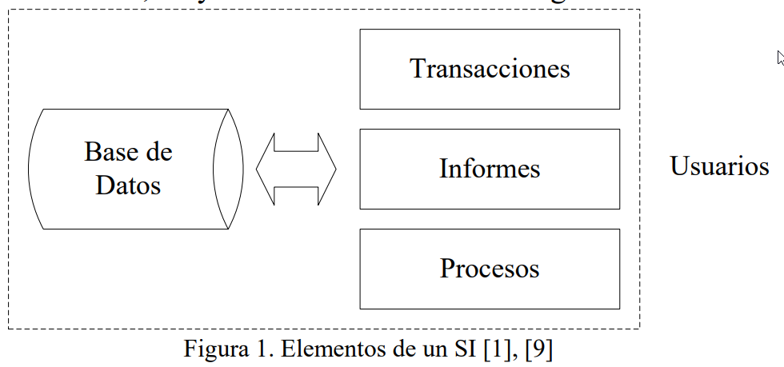

# Sistema de Información

Francisco M. Gonzáles nos define los Sistemas de Información (SI), en forma general, como aquél conjunto ordenado de elementos _(no necesariamente computacionales)_ que permiten manipular toda aquella información necesaria para implementar aspectos específicos de la toma de decisiones.

Es una aceptada conceptualización considerar a un SI, aquél que permite recopilar, administrar y manipular un conjunto de datos que conforman la información necesaria para que los estamentos ejecutivos de una organización puedan realizar una toma de decisiones informadamente.

## Elementos de un Sistema de Información

<figure><figcaption>
Elemetntos de un sistema de informacion: obtenido de: <a href="https://www.uv.mx/personal/artulopez/files/2012/08/FundamentosSistemasInformacion.pdf">https://www.uv.mx/personal/artulopez/files/2012/08/FundamentosSistemasInformacion.pdf</a>
</figcaption></figure>

* **Base de Datos:** Es donde se almacena toda la información que se requiere para la toma de decisiones. La información se organiza en registros específicos e identificables.
* **Transacciones:** Corresponde a todos los elementos de interfaz que permiten al usuario: consultar, agregar, modificar o eliminar un registro específico de Información.
* **Informes:** Corresponden a todos los elementos de interfaz mediante los cuales el usuario puede obtener uno o más registros y/o información de tipo estadístico (contar, sumar) de acuerdo a criterios de búsqueda y selección definidos.
* **Procesos:** Corresponden a todos aquellos elementos que, de acuerdo a una lógica predefinida, obtienen información de la base de datos y generan nuevos registros de información. Los procesos sólo son controlados por el usuario (de ahí que aparezca en línea de puntos).
* **Usuario:** Identifica a todas las personas que interactúan con el sistema, esto incluye desde el máximo nivel ejecutivo que recibe los informes de estadísticas procesadas, hasta el usuario operativo que se encarga de recolectar e ingresar la información al sistema.
* **Procedimientos Administrativos:** Corresponde al conjunto de reglas y políticas de la organización, que rigen el comportamiento de los usuarios frente al sistema. Particularmente, debieran asegurar que nunca, bajo ninguna circunstancia un usuario tenga acceso directo a la Base de Datos.
