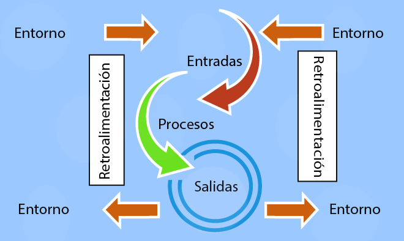

# Sistema

## Definición

<mark style="color:orange;">Un sistema es un conjunto organizado de elementos interrelacionados que trabajan juntos para lograr un objetivo común.</mark> Puede ser automático o manual y comprende personas, máquinas y métodos organizados para procesar, transmitir y diseminar datos.  A continuación se presentan los siguientes ejemplos:

| Ejemplo de Sistema | Elementos Interrelacionados	                                                                | Objetivo Común                                                                  |
| ------------------ | ------------------------------------------------------------------------------------------- | ------------------------------------------------------------------------------- |
| Un automóvil       | Motor, ruedas, chasis, sistema eléctrico, conductor                                         | Transportar personas y objetos de un lugar a otro de manera eficiente y segura. |
| Una empresa        | Empleados, maquinaria, recursos financieros, sistemas de información, clientes              | Producir bienes o servicios y generar ganancias.                                |
| El cuerpo humano   | Órganos (corazón, pulmones, cerebro), sistemas (circulatorio, nervioso, digestivo), células | Mantener al organismo vivo y funcionando correctamente.                         |

### Componentes de los sistemas

De forma general un sistema cuenta los siguientes elementos:

<figure><figcaption>
Componentes de un sistema: obtenido de: <a href="https://programas.cuaed.unam.mx/repositorio/moodle/pluginfile.php/1100/mod_resource/content/17/uapa_teoria_conceptosu4_/index.html">https://programas.cuaed.unam.mx/repositorio/moodle/pluginfile.php/1100/mod_resource/content/17/uapa_teoria_conceptosu4_/index.html</a>
</figcaption></figure>

* **Entorno o  Ambiente:** Es el medio ambiente exterior que rodea al sistema.
* **Entradas:** Es el medio ambiente exterior que rodea al sistema.
* **Procesos:**  Son todas las tareas y acciones que transforman una entrada en una salida.
* **Salidas:** Es aquello en que las entradas son transformadas por los procesos (pueden ser productos o servicios). Son la finalidad para la cual los elementos están relacionados, organizados y trabajan como un todo.
* **Retroalimentación:** Es la función que le permite al sistema comparar sus salidas con una expectativa y criterios previamente establecidos.
