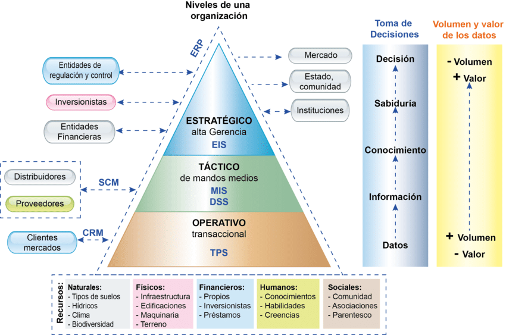

# Tipos de Sistemas de Información

<figure><figcaption>
Capítulo 7: Inteligencia de negocios en el sector agropecuario - Scientific Figure on ResearchGate. Available from: https://www.researchgate.net/figure/Relacion-entre-los-sistemas-de-informacion-y-los-niveles-de-una-organizacion_fig1_327703659 [accessed 18 Aug 2024]
</figcaption></figure>

## Tipos de Sistemas de Información

existen diferentes tipos de sistemas de información según el nivel organizacional donde dan apoyo. Estos niveles son:

1. **Operaciones:** En este nivel se encuentran los Sistemas de Procesamiento de Transacciones (TPS). Estos sistemas registran las transacciones diarias del negocio, como ventas, inventarios, nómina, etc. Un ejemplo de un TPS es un sistema de nómina que registra las horas trabajadas por los empleados y genera cheques de pago.
2. **Gerencia de Operaciones:** En este nivel se encuentran los **Sistemas de Información Gerencial (MIS)**. Estos sistemas monitorean el desempeño de la organización y comparan los resultados reales con los objetivos establecidos. Un ejemplo de un MIS es un sistema que genera informes sobre las ventas por región o producto.
3. **Gerencia Intermedia:** En este nivel se encuentran los **Sistemas de Soporte a la Toma de Decisiones (DSS)**. Estos sistemas ayudan a los gerentes a tomar decisiones no rutinarias al analizar información tanto interna como externa de la organización. Un ejemplo de un DSS es un sistema que simula el impacto en la producción de duplicar las ventas en un mes determinado.
4. **Alta Gerencia:** En este nivel se encuentran los **Sistemas de Apoyo a Ejecutivos (EIS)**. Estos sistemas ayudan a los ejecutivos a tomar decisiones estratégicas a largo plazo al presentar información sobre tendencias de la industria, la posición competitiva de la empresa y oportunidades de mercado. Un ejemplo de un EIS es un sistema que muestra gráficos y estadísticas sobre el consumo de productos en diferentes regiones.
